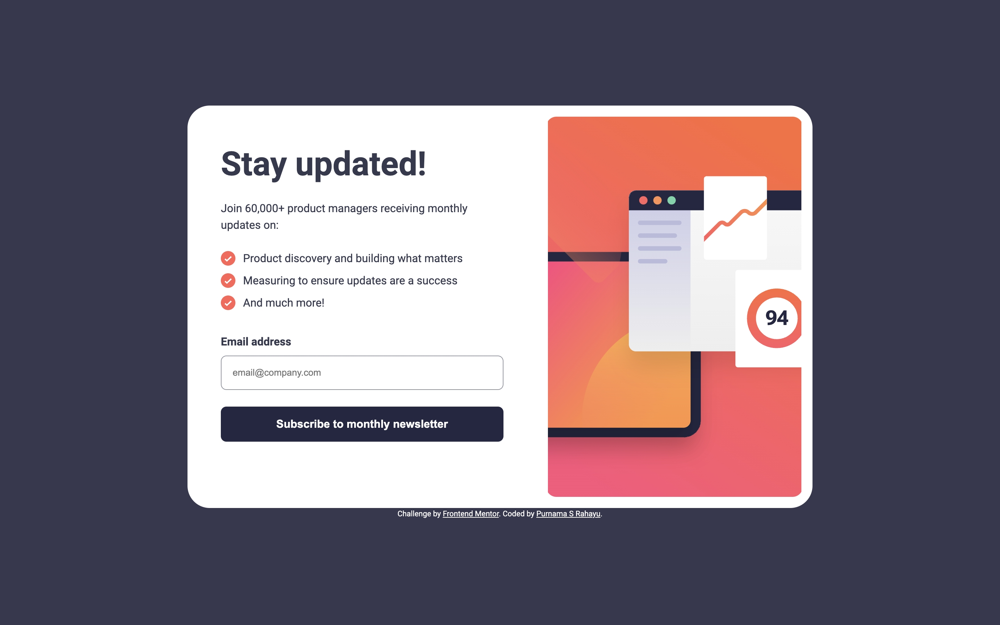

# Frontend Mentor - Newsletter sign-up form with success message solution

This is a solution to the [Newsletter sign-up form with success message challenge on Frontend Mentor](https://www.frontendmentor.io/challenges/newsletter-signup-form-with-success-message-3FC1AZbNrv). Frontend Mentor challenges help you improve your coding skills by building realistic projects. 

## Table of contents

- [Overview](#overview)
  - [The challenge](#the-challenge)
  - [Screenshot](#screenshot)
  - [Links](#links)
- [My process](#my-process)
  - [Built with](#built-with)
  - [What I learned](#what-i-learned)
  - [Continued development](#continued-development)
  - [Useful resources](#useful-resources)
- [Author](#author)
- [Acknowledgments](#acknowledgments)

## Overview

### The challenge

Users should be able to:

- Add their email and submit the form
- See a success message with their email after successfully submitting the form
- See form validation messages if:
  - The field is left empty
  - The email address is not formatted correctly
- View the optimal layout for the interface depending on their device's screen size
- See hover and focus states for all interactive elements on the page

### Screenshot

### Links

- Solution URL: [GitHub](https://github.com/catreedle/newsletter-sign-up)
- Live Site URL: [Live Site](https://newsletter-sign-up-ochre.vercel.app/)

## My process

### Built with

- Semantic HTML5 markup
- CSS custom properties
- Flexbox
- Mobile-first workflow
- Vanilla JS

**Note: These are just examples. Delete this note and replace the list above with your own choices**

### What I learned

I learned to handle form with JS, also learned to write BEM syntax CSS.

### Continued development

There are still many rooms for improvement: padding for tablet view, I struggled with adding animation for switching between the email form and the success message, it made me rethink about how I styled them.

### Useful resources

- [BEM CSS](https://csswizardry.com/2013/01/mindbemding-getting-your-head-round-bem-syntax/) - This helped me understand my own CSS.
- [How to Build and Validate Beautiful Forms with Vanilla HTML, CSS, & JS] (https://www.freecodecamp.org/news/build-and-validate-beautiful-forms-with-vanilla-html-css-js/) - Helped me with form validation.

## Author

- Website - [Purnama S Rahayu](https://www.purnamaa.dev)
- Frontend Mentor - [@catreedle](https://www.frontendmentor.io/profile/catreedle)
